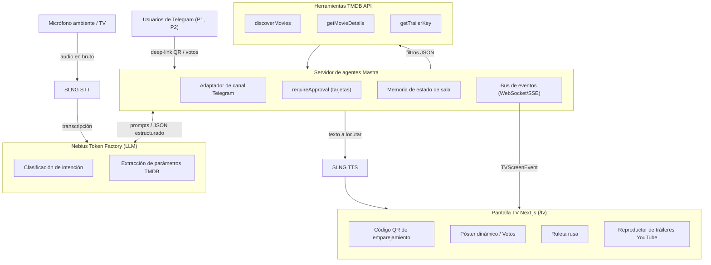
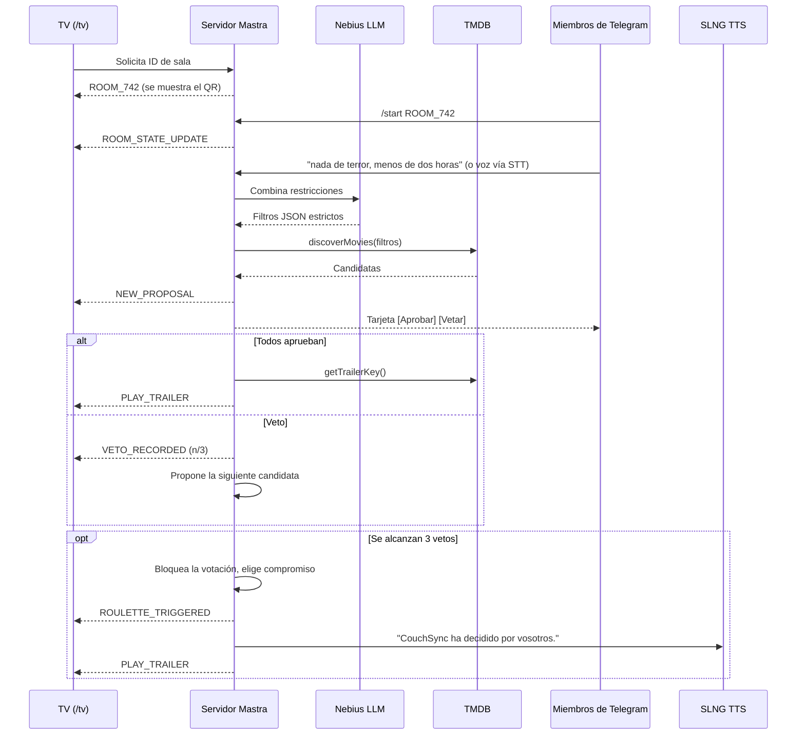
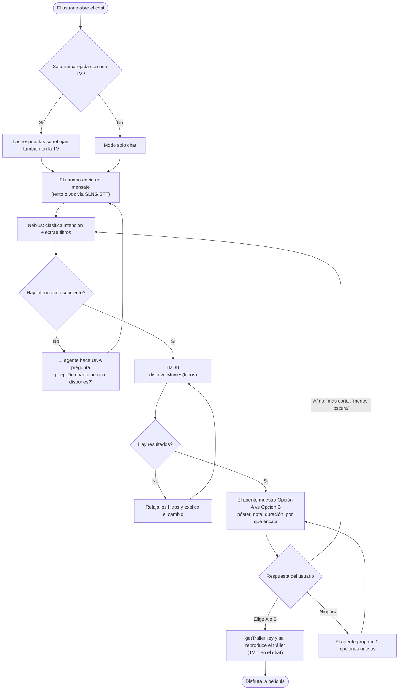
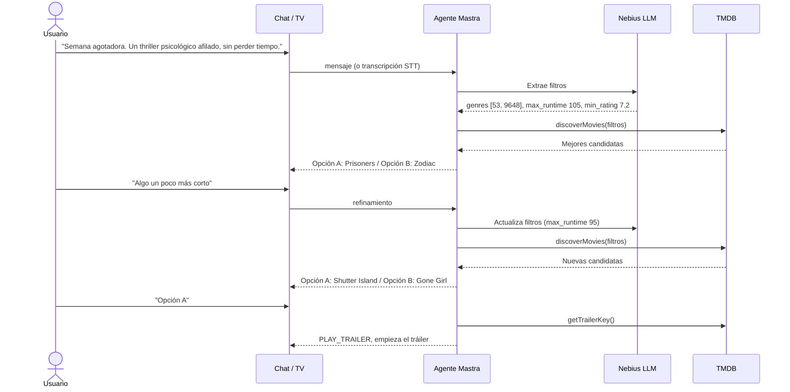
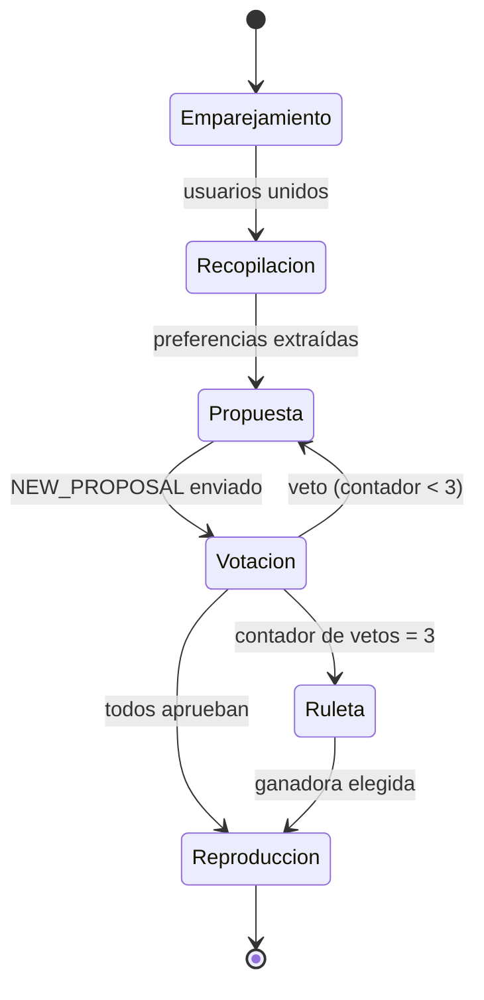

# CouchSync

[English](README.md) | **Español**

Sistema de entretenimiento para el salón impulsado por IA que acaba con la parálisis de decisión en las Smart TV. CouchSync es un sumiller de contenido personalizado para quien ve solo y un mediador de consenso en tiempo real para grupos, que sincroniza una interfaz de TV a 3 metros con entradas de baja fricción: voz ambiental y Telegram.

## Retos del hackathon a los que apuntamos

| Reto | Papel en CouchSync |
|---|---|
| AI Agent for TV Content Recommendation | UI para TV, navegación espacial, tráiler automático, diálogo de varios turnos |
| Nebius Token Factory | Inferencia LLM: de voz/texto a consultas TMDB estructuradas, negociación de compromisos en grupo |
| Mastra (`@mastra/core`) | Orquestación de agentes, memoria de sesión, flujos `requireApproval` en Telegram |
| SLNG / unmute.ai | STT de baja latencia para el audio de la sala, TTS para los anuncios del agente |
| Norma y Galtea | Análisis estático con Norma MCP, pruebas adversariales con Galtea |

## Mapa de herramientas por componente

| Parte del proyecto | Herramienta | Qué hace ahí |
|---|---|---|
| Entrada de audio (voz) | SLNG STT | Convierte el audio del micrófono de la TV/sala en transcripción (modo solo, elecciones por voz como "Opción A") |
| Entender las peticiones | Nebius Token Factory (LLM) | Clasifica la intención y convierte transcripción/texto en filtros JSON estrictos (géneros, duración máxima, nota mínima) |
| Compromiso en grupo | Nebius Token Factory (LLM) | Pondera las preferencias de los miembros y elige el título de compromiso tras 3 vetos |
| Cerebro del agente y orquestación | Mastra | Ejecuta agentes y herramientas, guarda el estado por sala (miembros, vetos, películas descartadas), gestiona la máquina de estados de votación |
| Votación Aprobar/Vetar | Mastra `requireApproval` + Telegram | Envía tarjetas [Aprobar] / [Vetar] y gestiona las pulsaciones |
| Incorporación y entrada desde el móvil | Telegram Bot API | Deep-link del QR `?start=ROOM_742`, preferencias por texto, modo alternativo solo-chat para jueces remotos |
| Búsqueda de películas | TMDB API (herramientas de Mastra) | `discoverMovies` busca con filtros, `getMovieDetails` obtiene sinopsis/póster/duración, `getTrailerKey` obtiene la clave de YouTube |
| Sincronización en vivo con la TV | Bus de eventos de Mastra (WebSocket/SSE) | Envía `NEW_PROPOSAL`, `VETO_RECORDED`, `ROULETTE_TRIGGERED`, `PLAY_TRAILER` a la pantalla |
| Pantalla de TV | Next.js + Tailwind | Muestra el QR, el escenario del póster, el contador de vetos y la ruleta |
| Reproducción del tráiler | react-player + YouTube | Reproduce el tráiler a pantalla completa con la clave de TMDB |
| Anuncios en la TV | SLNG TTS | Dice frases como "No os habéis puesto de acuerdo. CouchSync ha decidido por vosotros." |
| Exposición en desarrollo local | ngrok | URL pública de webhook para que Telegram alcance el servidor local |
| Calidad y seguridad del código | Norma MCP | Analiza el código desde el primer commit; los hallazgos alimentan la defensa del código |
| Pruebas de robustez | Galtea | Prompts adversariales (p. ej. saltarse el límite de vetos); se parchean los prompts y se re-ejecuta como prueba de la corrección |

Flujo de datos: la voz va SLNG STT → Nebius → Mastra → TMDB → bus de eventos → TV. La entrada desde el móvil va Telegram → Mastra → Nebius y luego sigue el mismo camino hasta la TV. Norma y Galtea quedan fuera del flujo en ejecución y solo revisan el código.

## Arquitectura



## Flujo del modo grupo



## Experiencia de chat en modo solo

Una sola persona habla con CouchSync como con un asistente de chat (chat web, MD de Telegram o voz en la TV). El agente nunca muestra una parrilla infinita: hace como mucho una pregunta de aclaración, presenta dos opciones en el chat y afina hasta que el usuario elige una.



### Ejemplo de conversación



## Máquina de estados de vetos



## Recorridos de usuario

1. **Grupo ("Watch Party")**: escanea el QR de la TV, envía preferencias por voz o Telegram, aprueba o veta propuestas y, tras 3 vetos, decide la Ruleta de Compromiso.
2. **Solo ("Sumiller por voz directa")**: di tu estado de ánimo, la TV muestra un dilema de dos opciones (A vs B), di "Opción A" y se reproduce el tráiler.
3. **Juez remoto (evaluación en frío)**: escribe al bot sin `roomId`. Recurre a un recomendador solo por chat con aprobar/rechazar en el propio chat.

## Contratos de datos

### Salida de extracción de Nebius

```json
{
  "genres": [53, 9648],
  "max_runtime": 105,
  "min_rating": 7.2,
  "release_year_gte": 2010,
  "rationale": "Thrillers psicológicos afilados de menos de 105 minutos."
}
```

Obligatorios: `genres`, `rationale`. Los IDs de género son los de TMDB (28 Acción, 35 Comedia, 878 Ciencia ficción, 53 Thriller, 9648 Misterio).

### Bus de eventos de la TV (`TVScreenEvent`)

Eventos: `ROOM_STATE_UPDATE`, `NEW_PROPOSAL`, `VETO_RECORDED`, `ROULETTE_TRIGGERED`, `PLAY_TRAILER`. Define los tipos compartidos una sola vez en `couchsync-server` y refléjalos en `couchsync-tv`.

## Estructura del repositorio

```
hackbarna26/
|-- couchsync-server/   # Servidor de agentes Mastra (herramientas, agentes, bus de eventos, Telegram)
|-- couchsync-tv/       # Frontend TV a 3 metros con Next.js + Tailwind
|-- docs/               # Especificaciones y notas del pitch
|-- .env.example        # Credenciales necesarias (copiar a .env)
```

## Primeros pasos

1. Copia la plantilla de entorno y rellena las credenciales:
   ```bash
   cp .env.example .env
   ```
2. Crea el backend (una vez):
   ```bash
   npm create mastra@latest couchsync-server
   ```
3. Crea el frontend de TV (una vez):
   ```bash
   npx create-next-app@latest couchsync-tv --typescript --tailwind --app
   cd couchsync-tv && npm i react-player qrcode.react
   ```
4. Ejecuta ambos (terminales separadas):
   ```bash
   cd couchsync-server && npm run dev
   cd couchsync-tv && npm run dev
   ```
5. Expón el servidor para el webhook de Telegram (p. ej. `ngrok http 4111`) y define `PUBLIC_BASE_URL`.

## Hoja de ruta

- [ ] **Fase 1: Preparación**: crear Mastra + Next.js, conectar Norma MCP, configurar `.env`
- [ ] **Fase 2: Herramientas base**: herramientas TMDB (Zod), enrutado de modelo a Nebius, prompt de extracción
- [ ] **Fase 3: UX en tiempo real**: bus WebSocket/SSE, vista QR, escenario del póster, ruleta, votación con `requireApproval`, SLNG STT/TTS
- [ ] **Fase 4: Endurecimiento**: pruebas adversariales con Galtea, escaneo final con Norma, defensa de código de 2 min, ensayo del pitch de 3 min

## Notas de seguridad

- Nunca hagas commit de `.env`. Solo se versiona `.env.example`.
- Trata todo texto de usuario (voz/Telegram) como no confiable: el límite de vetos y el estado de la sala se aplican en el servidor, nunca solo mediante el prompt.
