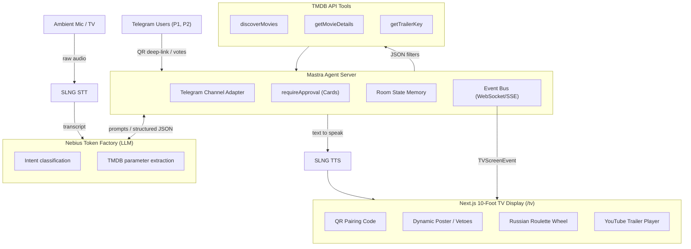
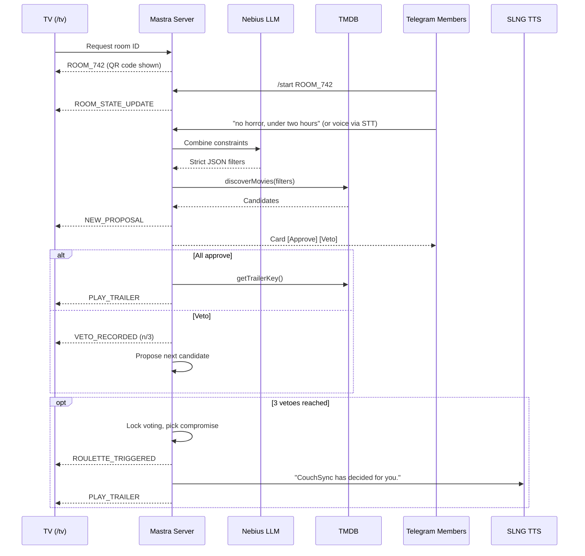
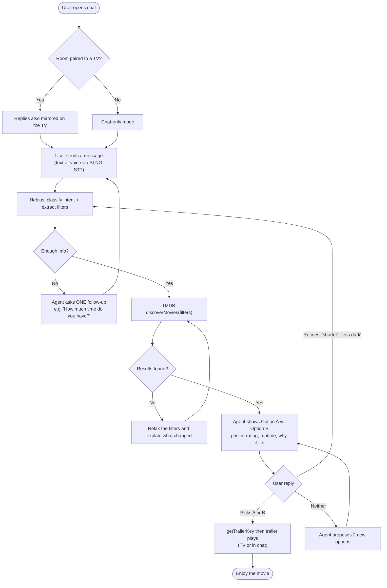
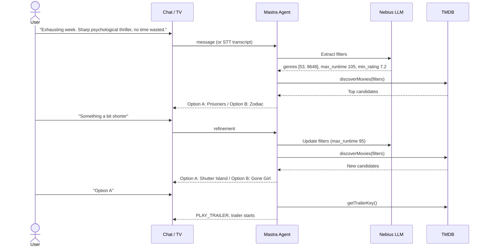
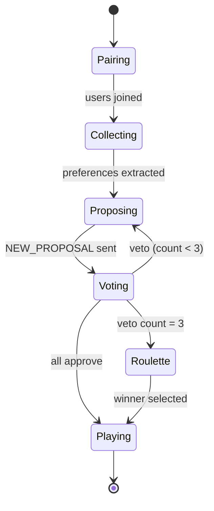

# CouchSync

**English** | [Español](README.es.md)

AI-powered living room entertainment system that ends decision paralysis on Smart TVs. CouchSync is a personalized content sommelier for solo viewers and a real-time consensus mediator for groups, syncing a 10-foot TV interface with low-friction inputs: ambient voice and Telegram.

## Hackathon Tracks Targeted

| Track | Role in CouchSync |
|---|---|
| AI Agent for TV Content Recommendation | 10-foot UI, spatial navigation, trailer autoplay, multi-turn dialogue |
| Nebius Token Factory | LLM inference: voice/text to structured TMDB queries, group compromise negotiation |
| Mastra (`@mastra/core`) | Agent orchestration, session memory, Telegram `requireApproval` flows |
| SLNG / unmute.ai | Low-latency STT for room audio, TTS for agent announcements |
| Norma & Galtea | Static analysis via Norma MCP, adversarial testing via Galtea |

## Tool-to-Component Map

| Project part | Tool | What it does there |
|---|---|---|
| Room audio in (voice) | SLNG STT | Turns TV/room microphone audio into a transcript (solo mode, voice picks like "Option A") |
| Understanding requests | Nebius Token Factory (LLM) | Classifies intent and converts transcript/text into strict JSON filters (genres, max runtime, min rating) |
| Group compromise | Nebius Token Factory (LLM) | Weighs members' preferences and picks the compromise title after 3 vetoes |
| Agent brain and orchestration | Mastra | Runs agents and tools, holds per-room state (members, vetoes, discarded movies), runs the voting state machine |
| Approve/Veto voting | Mastra `requireApproval` + Telegram | Sends [Approve] / [Veto] cards and handles button presses |
| Onboarding and phone input | Telegram Bot API | QR deep-link `?start=ROOM_742`, text preferences, chat-only fallback for remote judges |
| Finding movies | TMDB API (Mastra tools) | `discoverMovies` searches with filters, `getMovieDetails` gets synopsis/poster/runtime, `getTrailerKey` gets the YouTube key |
| Live sync to the TV | Mastra event bus (WebSocket/SSE) | Pushes `NEW_PROPOSAL`, `VETO_RECORDED`, `ROULETTE_TRIGGERED`, `PLAY_TRAILER` to the screen |
| TV screen | Next.js + Tailwind | Renders QR code, poster stage, veto counter, roulette wheel |
| Trailer playback | react-player + YouTube | Plays the trailer full screen using the key from TMDB |
| TV announcements | SLNG TTS | Speaks lines like "You couldn't agree. CouchSync has decided for you." |
| Local dev exposure | ngrok | Public webhook URL so Telegram can reach the local server |
| Code quality and security | Norma MCP | Scans code from the first commit; findings feed the code defense |
| Robustness testing | Galtea | Adversarial prompts (e.g. bypassing the veto limit); patch prompts and re-run for proof of fix |

Data flow: voice goes SLNG STT → Nebius → Mastra → TMDB → event bus → TV. Phone input goes Telegram → Mastra → Nebius, then follows the same path to the TV. Norma and Galtea sit outside the runtime flow and only check the code.

## Architecture



## Group Mode Flow



## Solo Chat Experience

A single user talks to CouchSync like a chat assistant (web chat, Telegram DM, or voice on the TV). The agent never shows an endless grid: it asks at most one follow-up, then presents two options in the chat and refines until the user picks one.



### Example conversation



## Veto State Machine



## User Journeys

1. **Group ("Watch Party")**: scan the TV QR code, submit preferences by voice or Telegram, approve or veto proposals, and after 3 vetoes the Compromise Roulette decides.
2. **Solo ("Direct Voice Sommelier")**: speak a mood, the TV shows a two-choice dilemma (A vs B), say "Option A" and the trailer plays.
3. **Remote judge (cold evaluation)**: message the bot without a `roomId`. It falls back to a chat-only recommender with in-chat approve/decline.

## Data Contracts

### Nebius extraction output

```json
{
  "genres": [53, 9648],
  "max_runtime": 105,
  "min_rating": 7.2,
  "release_year_gte": 2010,
  "rationale": "Sharp psychological thrillers under 105 minutes."
}
```

Required: `genres`, `rationale`. Genre IDs are TMDB IDs (28 Action, 35 Comedy, 878 Sci-Fi, 53 Thriller, 9648 Mystery).

### TV event bus (`TVScreenEvent`)

Events: `ROOM_STATE_UPDATE`, `NEW_PROPOSAL`, `VETO_RECORDED`, `ROULETTE_TRIGGERED`, `PLAY_TRAILER`. Define the shared types once in `couchsync-server` and mirror them in `couchsync-tv`.

## Repository Layout

```
hackbarna26/
|-- couchsync-server/   # Mastra agent server (tools, agents, event bus, Telegram)
|-- couchsync-tv/       # Next.js + Tailwind 10-foot TV frontend
|-- docs/               # Specs and pitch notes
|-- .env.example        # Required credentials (copy to .env)
```

## Getting Started

1. Copy the env template and fill in credentials:
   ```bash
   cp .env.example .env
   ```
2. Scaffold the backend (once):
   ```bash
   npm create mastra@latest couchsync-server
   ```
3. Scaffold the TV frontend (once):
   ```bash
   npx create-next-app@latest couchsync-tv --typescript --tailwind --app
   cd couchsync-tv && npm i react-player qrcode.react
   ```
4. Run both (separate terminals):
   ```bash
   cd couchsync-server && npm run dev
   cd couchsync-tv && npm run dev
   ```
5. Expose the server for the Telegram webhook (e.g. `ngrok http 4111`) and set `PUBLIC_BASE_URL`.

## Roadmap

- [ ] **Phase 1: Setup**: scaffold Mastra + Next.js, connect Norma MCP, configure `.env`
- [ ] **Phase 2: Core tooling**: TMDB tools (Zod), Nebius model routing, extraction prompt
- [ ] **Phase 3: Real-time UX**: WebSocket/SSE bus, QR view, poster stage, roulette wheel, `requireApproval` voting, SLNG STT/TTS
- [ ] **Phase 4: Hardening**: Galtea adversarial tests, Norma final scan, 2-min code defense, 3-min pitch rehearsal

## Security Notes

- Never commit `.env`. Only `.env.example` is tracked.
- Treat all user text (voice/Telegram) as untrusted: veto limits and room state are enforced server-side, never by the prompt alone.
